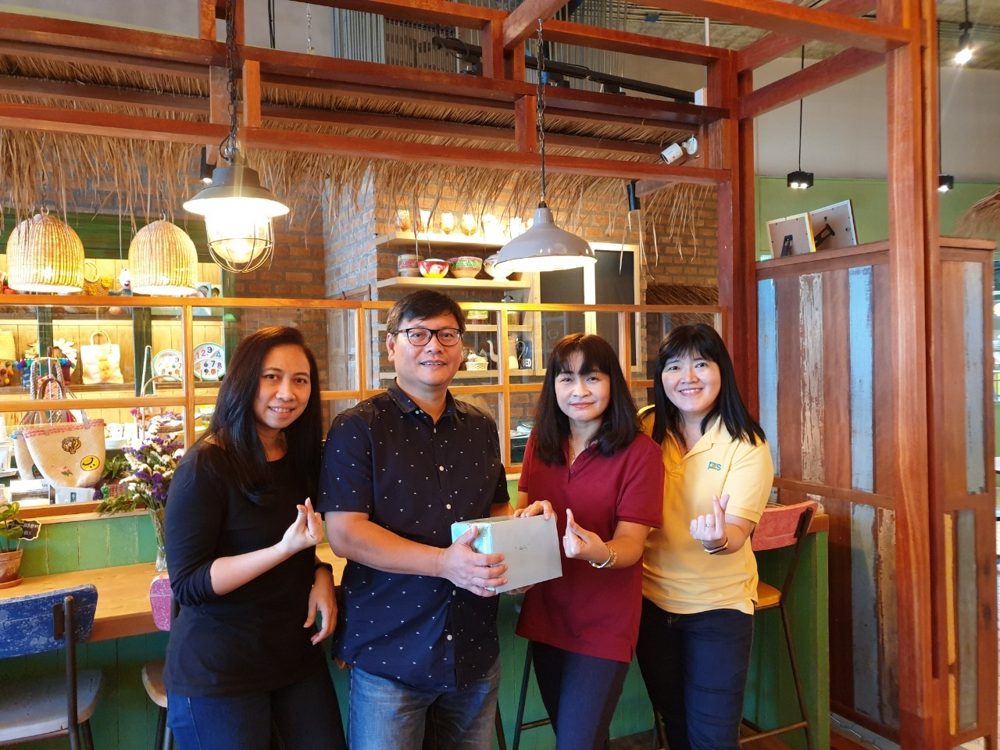

# Hi there 👋 Let's learn building web applications
🤔 I am interested in developing web applications with AspNetCore. My favorites computer programming and technologies are mostly from Microsoft likes c#, Asp.Net core, Asp.Net framework, EntityFramework etc. I also like JavaScript and coding web applications with Angular, React. I normaly use Visual Studio and Visual studio code for coding the applications.

I am now learning how to build authrozie server with Identity server using Micrsoft technology Duende IdentityServer. Here are project concept:
1. Using Microsft AspNet core with individual template (The project named BackOffice.Ids)
    - customize IdentityUser and IdentityRole classes by adding some properties like descriptions and membership type.
    - use the Account manage features coming with the template to handle ApplicationUsers 
    - add Role management features.
    - Implement Duende IdentityServer to handle Clients, Authentications, Authorizations between the server, api resources, and clients.
    - Peresist Clients, Identity Resources, Identity Scopes,Api Scopes, and Api resources with Configuration Data. Lerning how to implement the ConfigurationDbContext and PersistedGrantDbContext.
    - custom some UI pages to handel Clients, Api Scope, Api Resources, Identity Scope, and Identity Resources.
2. I also create Web Api project (named BackOffice.Api) to act as Api resources. The purpose of this project is to learn Authentication and Authorization in AspNetCore WebApi, especially OpenIdConnect, OAuth2.0. 
    It is interesting how to cconfig SwaggerUI to authenticate using OAuth2.0, using ClientCredentials and AuthorizationCode flows in the same system.
3. Finally I build another three projects, which are:
    - BackOffice.Clients This project is AspNetCore console project connect to the WebApi with ClientCredentails flow.
    - BackOffice.Web This project is AspNetCore Web Mvc/RazorPage for accessing BackOffice.Api resources
    - Foodshop. This project is Angular16. It is for leaning about connecting SPA web application to the Authorization server (BackOffice.Ids) and how to guard components.

All of these projects I try to build them base on real world applications and then people, who are interested coding, can learn and enjoy the coding.    

##Tools 
1. Windows 11 Pro
    - Visual Studio 2022, for coding BackOffice.Ids, BackOffice.Api, BackOffice.Clients
    - Visual Studio Code, for coding Foodshop (Angular)
    - Virual Host
2. Ubuntu20.04  
    A virtual machine, hosted on Windows 11 
    - Microsoft SQL 2019 Developer Edition.
    - Apache2 web application as front-end of (BackOffice.Ids, BackOffice.Api)
    - AspNet Core 6.0  for running BackOffice.Ids, BackOffice.Api
    - FTP and SAMBA for deploying projects
## Projects
    ### BackOffice.Ids is an authentication and authorization server. The project was created based on AspNetCore with Individual account template, addon with Duende IdentityServer api.
    ### BackOffice.Api is AspNetCore Web Api project, supports OAuth2.0 and OpenIdConnect. The project implement Claim and Role base authorization. 
    ### BackOffice.Commerce  is .Net core library project provides business logic services, includes data access layers, models.
    ### BackOffice.Web is Angular project, calling services from BackOffice.Api by getting authentication and authorization from BackOffice.Ids.
    ### BackOffice.Client is AspNetCore Console application. This project is for:
        - running data migration 
        - seeding demo data
        - testing api functions.
## Sources
    - https://identityserver4.readthedocs.io/en/latest/
    - https://docs.duendesoftware.com/identityserver/v6
    - https://learn.microsoft.com/en-us/aspnet/core/?view=aspnetcore-7.0

<!--
**YuthanaR/YuthanaR** is a ✨ _special_ ✨ repository because its `README.md` (this file) appears on your GitHub profile.

Here are some ideas to get you started:

- 🔭 I’m currently working on ...
- 🌱 I’m currently learning ...
- 👯 I’m looking to collaborate on ...
- 🤔 I’m looking for help with ...
- 💬 Ask me about ...
- 📫 How to reach me: ...
- 😄 Pronouns: ...
- ⚡ Fun fact: ...

<picture>
 <source media="(prefers-color-scheme: dark)" srcset="./assets/1.jpg">
 <source media="(prefers-color-scheme: light)" srcset="./assets/1.jpg">
 
</picture>
-->
